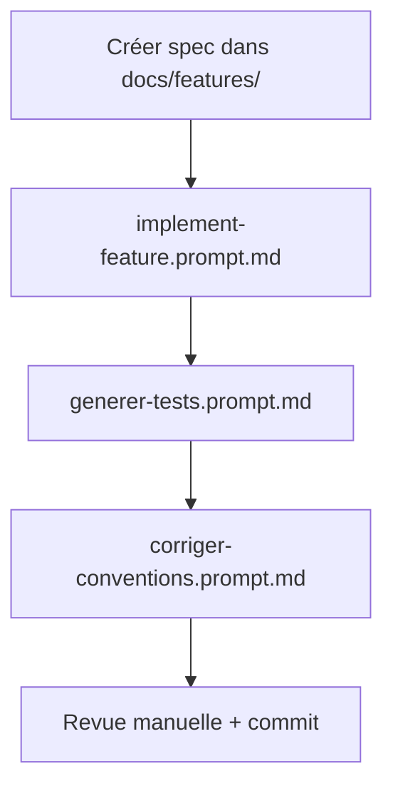
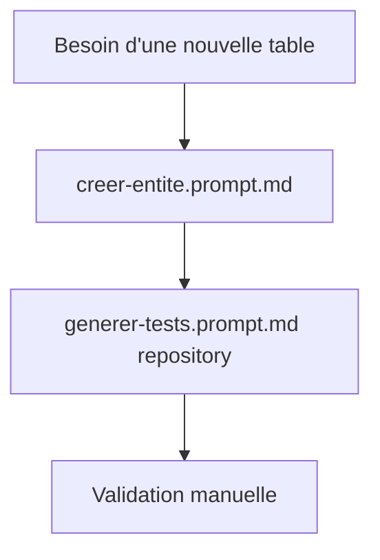
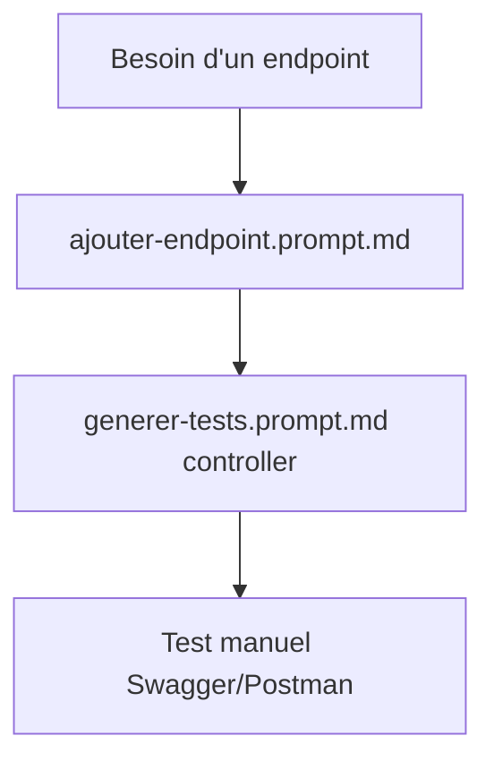

# 🚀 Guide d'utilisation des Prompts Copilot

Ce guide fournit des exemples concrets d'utilisation des prompts pour accélérer le développement.

## ⚖️ Frontière de responsabilité

- **`implement-feature` = spec-driven** : démarre depuis `docs/features/<feature>.md` et implémente ce qui est spécifié.
- **`creer-crud-complet` = scaffold-driven** : génère un CRUD standard complet sans exiger une spec détaillée.

## 📖 Scénarios d'utilisation

### Scénario 1 : Créer une feature CRUD complète "Product"

**Objectif** : Créer une gestion de produits avec backend + frontend + tests

#### Étape 1 : Créer la spécification
```bash
# Copier le template de feature
cp docs/features/_TEMPLATE.md docs/features/002-product-management.md

# Éditer la spec avec les user stories et la conception
```

#### Étape 2 : Générer le CRUD complet
**Utiliser** : `creer-crud-complet.prompt.md`

```text
/creer-crud-complet resource=Product fields=name:String,description:String,price:BigDecimal,quantity:Integer,category:String
```

**Fallback (secondaire)** :
```text
Utilise le prompt creer-crud-complet pour créer la ressource Product avec les champs name, description, price, quantity et category.
```

**Résultat attendu** :
- ✅ Backend complet (entity, DTO, repository, service, controller, migration)
- ✅ Frontend complet (types, service, hook, composants, page)
- ✅ Tests unitaires et d'intégration

#### Étape 3 : Vérifier les conventions
**Utiliser** : `corriger-conventions.prompt.md`

```text
/corriger-conventions scope=all
```

#### Étape 4 : Compléter les tests
**Utiliser** : `generer-tests.prompt.md`

```text
/generer-tests type=all target=service,controller
```

---

### Scénario 2 : Ajouter une entité simple "Category"

**Objectif** : Ajouter une table catégorie sans interface utilisateur

#### Étape unique : Créer l'entité
**Utiliser** : `creer-entite.prompt.md`

```text
/creer-entite entity=Category fields=name:String,description:String,active:Boolean
```

**Résultat attendu** :
- ✅ `Category.java` avec annotations JPA
- ✅ `CategoryRepository.java` avec méthodes de requête
- ✅ Migration Flyway `V{n}__create_category.sql`

---

### Scénario 3 : Ajouter un endpoint de recherche

**Objectif** : Ajouter un endpoint `/api/products/search?keyword=...&category=...`

#### Étape 1 : Ajouter l'endpoint
**Utiliser** : `ajouter-endpoint.prompt.md`

```text
/ajouter-endpoint controller=ProductController method=GET path=/api/products/search description="Rechercher des produits par mot-clé et catégorie"
```

#### Étape 2 : Tester l'endpoint
**Utiliser** : `generer-tests.prompt.md`

```text
/generer-tests type=integration target=controller
```

---

### Scénario 4 : Implémenter une feature depuis une spec

**Objectif** : Implémenter la feature documentée dans `docs/features/003-user-profile.md`

#### Étape unique : Implémenter la feature
**Utiliser** : `implement-feature.prompt.md`

```text
/implement-feature feature=user-profile scope=fullstack
```

**Résultat attendu** :
- ✅ Tout ce qui est spécifié dans `docs/features/003-user-profile.md`
- ✅ Backend + Frontend + Tests
- ✅ Documentation mise à jour

---

### Scénario 5 : Audit et correction d'un code legacy

**Objectif** : Corriger un code existant qui ne respecte pas les conventions

#### Étape 1 : Identifier les violations
```bash
# Backend
cd backend && ./mvnw checkstyle:check

# Frontend
cd frontend && npm run lint
```

#### Étape 2 : Corriger automatiquement
**Utiliser** : `corriger-conventions.prompt.md`

```text
/corriger-conventions scope=backend
```

**Résultat attendu** :
- ✅ IDs Long → UUID
- ✅ Ajout de timestamps
- ✅ Classes DTO → Records
- ✅ Annotations @Transactional correctes
- ✅ Noms de tables conformes

---

## 🎯 Workflow recommandé

### Pour une nouvelle feature complète



**Commandes** :
```bash
# 1. Créer la spec
cp docs/features/_TEMPLATE.md docs/features/00X-ma-feature.md
# Éditer la spec...

# 2. Implémenter
# /implement-feature feature=ma-feature scope=fullstack

# 3. Tester
# /generer-tests type=all

# 4. Vérifier conventions
# /corriger-conventions scope=all

# 5. Valider
cd backend && ./mvnw test
cd frontend && npm run test && npm run lint
```

---

### Pour une entité isolée



---

### Pour un endpoint spécifique



---

## 💡 Astuces et bonnes pratiques

### ✅ Bonnes pratiques

1. **Toujours lire le prompt avant** : comprendre ce qui va être généré
2. **Fournir des détails précis** : meilleurs résultats avec des inputs clairs
3. **Valider étape par étape** : vérifier chaque génération avant de continuer
4. **Utiliser les checklists** : suivre les étapes des prompts
5. **Tester immédiatement** : vérifier que le code fonctionne
6. **Versionner régulièrement** : commit après chaque génération validée

### 🎨 Personnaliser les prompts

Vous pouvez adapter les prompts à vos besoins :

```markdown
# Copier un prompt
cp .github/prompts/creer-entite.prompt.md .github/prompts/mon-prompt-custom.prompt.md

# Modifier selon vos besoins
# - Ajouter des sections spécifiques
# - Changer les exemples
# - Adapter les conventions
```

### 🔄 Combiner plusieurs prompts

Pour des tâches complexes, enchaînez les prompts :

```bash
# 1. Créer l'entité
# /creer-entite entity=Order fields=...

# 2. Ajouter un endpoint custom
# /ajouter-endpoint controller=OrderController method=POST path=/api/orders/{id}/validate

# 3. Générer les tests
# /generer-tests type=all target=service,controller

# 4. Vérifier la conformité
# /corriger-conventions scope=backend
```

---

## 📊 Comparaison avec les agents

| Approche | Quand l'utiliser | Avantages | Limites |
|----------|------------------|-----------|---------|
| **Prompts Copilot** | Développement interactif, itérations rapides | • Guidage étape par étape<br>• Flexible et adaptable<br>• Bon pour l'apprentissage | • Nécessite validation manuelle<br>• Moins automatisé |
| **Agents IA** | Génération automatisée, CI/CD | • Automatisation complète<br>• Reproductible<br>• Intégration CI/CD | • Moins interactif<br>• Nécessite configuration |
| **Skills** | Détails d'implémentation spécifiques | • Exemples de code prêts<br>• Conventions détaillées<br>• Référence rapide | • Nécessite adaptation<br>• Pas d'orchestration |

**Recommandation** : Utilisez les **prompts** pour le développement manuel, les **agents** pour l'automatisation, et les **skills** comme référence.

---

## 🛠️ Dépannage

### Problème : Le prompt ne génère pas le bon code

**Solution** :
1. Vérifier que les variables `${input:...}` sont correctement remplies
2. Lire la section "Contexte" du prompt
3. Fournir plus de détails dans la requête
4. Essayer de reformuler la demande

### Problème : Le code généré ne respecte pas les conventions

**Solution** :
```text
/corriger-conventions scope=all
```

### Problème : Les tests échouent

**Solution** :
1. Vérifier les logs d'erreur
2. Utiliser `generer-tests.prompt.md` pour ajouter des tests manquants
3. Corriger manuellement les tests générés
4. Relancer avec `mvn test` ou `npm run test`

### Problème : Conflit avec du code existant

**Solution** :
1. Faire un backup avant de générer : `git add . && git commit -m "backup"`
2. Générer le code
3. Résoudre les conflits manuellement
4. Ou revenir en arrière : `git reset --hard HEAD`

---

## 📚 Ressources complémentaires

- **[README des prompts](./README.md)** : Documentation complète
- **[AGENTS.md](../../AGENTS.md)** : Agents IA et composition multi-agents
- **[Copilot instructions](../copilot-instructions.md)** : Conventions globales
- **[Skills README](../skills/README.md)** : Templates de code détaillés
- **[Conventions README](../../docs/conventions/README.md)** : Règles backend/frontend/docker

---

## 🤝 Contribution

Pour améliorer les prompts ou en ajouter de nouveaux :

1. Identifier un besoin récurrent
2. Créer un prompt en suivant la structure standard
3. Tester sur plusieurs cas d'usage
4. Documenter dans ce guide
5. Soumettre une PR

---

**Bon développement ! 🚀**
